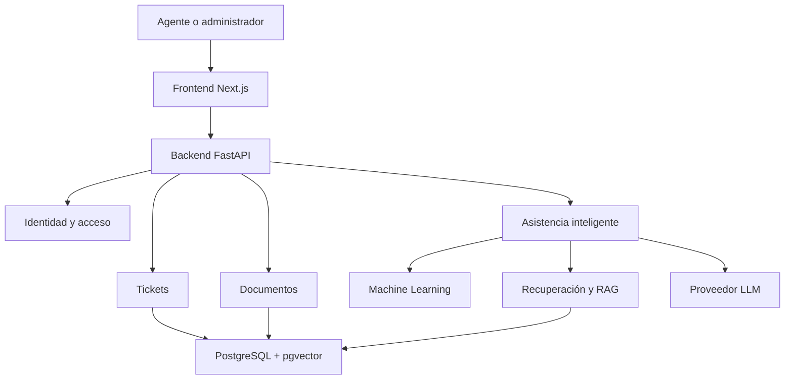

# SynapDesk

**SynapDesk** es una plataforma web inteligente de soporte TI orientada a asistir a agentes y administradores de mesas de ayuda en la clasificación, priorización y resolución de tickets.

El sistema combinará **Machine Learning**, recuperación semántica, **Retrieval-Augmented Generation (RAG)** y **Large Language Models (LLM)** para transformar documentación técnica y tickets históricos en recomendaciones contextualizadas y respaldadas por fuentes.

La inteligencia artificial no reemplazará al especialista. Las recomendaciones estarán sujetas a validación humana.

## Objetivo

Diseñar, desarrollar y evaluar una plataforma que asista a equipos de soporte TI mediante un flujo inteligente de clasificación automática, recuperación de información y generación contextualizada de recomendaciones.

El flujo general previsto es:

```text
Ticket → clasificación y priorización ML → recuperación semántica → RAG → LLM → recomendación con fuentes → validación humana
```

## Alcance funcional

SynapDesk contempla:

- gestión de usuarios y roles;
- creación y administración de tickets;
- clasificación automática de incidencias mediante Machine Learning;
- estimación de categoría, prioridad y nivel de confianza;
- gestión de documentación técnica;
- generación y almacenamiento de embeddings;
- búsqueda semántica mediante PostgreSQL y pgvector;
- recuperación de documentación y tickets históricos similares;
- generación contextualizada de recomendaciones mediante RAG y LLM;
- visualización de las fuentes utilizadas;
- aceptación, modificación o rechazo de recomendaciones;
- registro de predicciones, revisiones humanas y métricas de evaluación.

Las funcionalidades se desarrollarán incrementalmente. Su presencia en esta sección representa el alcance previsto del producto, no necesariamente su estado actual de implementación.

## Tecnologías adoptadas

### Frontend

- Next.js
- React
- Tailwind CSS

### Backend

- Python
- FastAPI
- Pydantic

### Persistencia

- PostgreSQL
- pgvector

### Infraestructura y desarrollo

- Docker y Docker Compose
- Git y GitHub
- GitHub Projects
- Jupyter Notebook o Google Colab para experimentación

## Tecnologías de inteligencia artificial en evaluación

- Scikit-learn para modelos base de clasificación;
- PyTorch, TensorFlow o Hugging Face únicamente si el modelo seleccionado los requiere;
- modelo de embeddings pendiente de evaluación;
- proveedor y modelo LLM pendientes de selección;
- LangChain o LlamaIndex únicamente si aportan valor demostrado al pipeline RAG.

La selección definitiva dependerá de los resultados obtenidos sobre los datos del proyecto. No se asume que todas estas tecnologías serán utilizadas simultáneamente.

## Arquitectura conceptual

SynapDesk comenzará como un **monolito modular**. Los módulos estarán separados internamente, pero el backend se desplegará inicialmente como una sola aplicación FastAPI.



Esta arquitectura favorece modularidad, bajo acoplamiento, mantenibilidad, pruebas e integración progresiva sin introducir la complejidad operacional de microservicios.

## Machine Learning

El componente de Machine Learning analizará el asunto y la descripción de los tickets para estimar atributos como:

- categoría;
- prioridad;
- área responsable, si el conjunto de datos permite evaluarla adecuadamente.

Los modelos candidatos se evaluarán con métricas apropiadas para clasificación, entre ellas:

- precisión;
- exhaustividad (*recall*);
- macro F1-score;
- weighted F1-score;
- matriz de confusión.

El modelo seleccionado deberá convertirse en un artefacto versionado e integrable. Un notebook por sí solo no se considerará un entregable ejecutable del producto.

## RAG y recuperación semántica

El pipeline RAG estará diseñado para recuperar información relevante desde:

- documentación técnica;
- manuales y procedimientos;
- tickets históricos;
- soluciones anteriores.

La información recuperada se utilizará como contexto controlado para generar recomendaciones. El sistema deberá conservar trazabilidad sobre las fuentes y comunicar cuando no exista información suficiente.

La recuperación y la generación permanecerán separadas para poder evaluarlas y probarlas independientemente.

## Validación humana

Las recomendaciones generadas por inteligencia artificial no reemplazarán la decisión del agente.

El usuario podrá:

- aceptar una recomendación;
- modificarla;
- rechazarla;
- consultar las fuentes utilizadas;
- entregar retroalimentación opcional.

El sistema registrará la recomendación original, la decisión humana, el usuario revisor y la fecha correspondiente.

## Equipo y responsabilidades

El proyecto es desarrollado por tres integrantes con las siguientes responsabilidades principales:

- arquitectura, backend, integración técnica y coordinación funcional del backlog;
- Machine Learning, datos, entrenamiento y evaluación de modelos;
- frontend, experiencia de usuario y facilitación del proceso Scrum.

Las decisiones técnicas y funcionales relevantes se revisan de manera colaborativa.

## Metodología

El desarrollo se organiza mediante **Scrum**, complementado con prácticas ligeras de MLOps para mantener trazabilidad sobre datasets, experimentos, modelos, versiones y métricas.

El equipo trabajará mediante ramas cortas, pull requests, revisión entre integrantes e integración progresiva en `main`.

## Estado del proyecto

SynapDesk se encuentra en desarrollo como parte de un **Proyecto APT de Ingeniería Informática**.

Actualmente el equipo trabaja en la preparación técnica del proyecto, incluyendo:

- arquitectura inicial;
- estructura del monorepositorio;
- convenciones Git;
- entorno local con Docker;
- PostgreSQL con pgvector;
- separación entre desarrollo y testing.

El objetivo semestral es obtener una versión:

- funcional;
- integrada;
- evaluada;
- documentada;
- contenerizada;
- desplegada en un entorno demostrativo.

## Documentación del proyecto

La documentación técnica se mantiene versionada junto al código:

- [Organización de la documentación](docs/README.md)
- [Estructura inicial del repositorio](docs/arquitectura/estructura-repositorio.md)
- [Estrategia de entornos](docs/arquitectura/entornos.md)
- [Estrategia Git](docs/gestion/estrategia-git.md)
- [Definición de Terminado](docs/gestion/definicion-terminado.md)
- [Registros de decisiones arquitectónicas](docs/adr/)
- [Contratos de integración](docs/contratos/)

Las reglas para ramas, commits y pull requests se encuentran en [CONTRIBUTING.md](CONTRIBUTING.md).

## Inicio rápido del entorno local

Crear la configuración local desde la plantilla:

```bash
cp .env.example .env
```

Modificar las contraseñas locales en `.env` y levantar PostgreSQL:

```bash
docker compose up -d db
docker compose ps
```

Las instrucciones completas se encuentran en [infra/README.md](infra/README.md).

## Fuera del alcance actual

Durante el semestre no se contempla desarrollar:

- una API empresarial pública para terceros;
- integraciones con Zendesk, Jira Service Management o Freshdesk;
- multi-tenancy empresarial;
- facturación o planes comerciales;
- microservicios;
- portal para desarrolladores;
- acuerdos de nivel de servicio empresariales.

## Evolución futura

Después de validar y desplegar la plataforma web, podrá evaluarse una API empresarial para integrar las capacidades de SynapDesk con sistemas externos de mesa de ayuda.

Esta posibilidad se considera trabajo futuro y no forma parte del alcance principal del APT.

## Licencia

La licencia será definida según los criterios académicos, institucionales y de propiedad intelectual acordados por el equipo.
