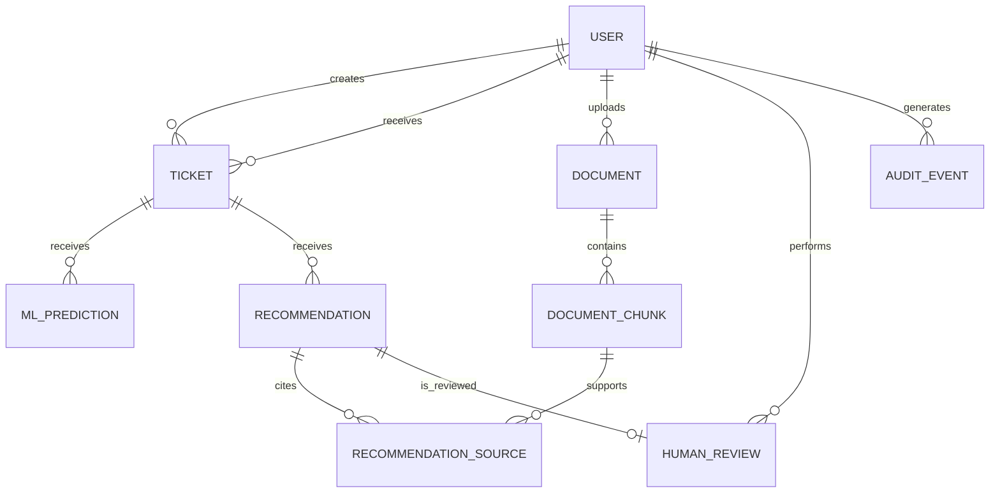

# Modelo inicial del dominio

## Propósito

Este documento define el vocabulario, las entidades y las relaciones iniciales de SynapDesk.

Su objetivo es alinear el frontend, el backend, la persistencia y los componentes de inteligencia artificial antes de implementar funcionalidades.

El modelo es una definición inicial y podrá evolucionar mediante pull requests y decisiones documentadas. No representa todavía un esquema físico definitivo de PostgreSQL.

## Principios

* Las entidades utilizarán identificadores UUID.
* Las fechas intercambiadas mediante la API utilizarán formato ISO 8601.
* PostgreSQL utilizará nombres en `snake_case`.
* La API y el frontend utilizarán nombres en `camelCase`.
* Los secretos, contraseñas y datos internos no se enviarán al frontend.
* Las predicciones automáticas se mantendrán separadas de las decisiones humanas.
* Las recomendaciones generadas conservarán trazabilidad sobre sus fuentes.
* Los registros históricos relevantes no se eliminarán físicamente sin una razón justificada.

## Entidades principales

### Usuario

Representa a una persona autorizada para utilizar SynapDesk.

Atributos iniciales:

| Atributo       | Descripción                                     |
| -------------- | ----------------------------------------------- |
| `id`           | Identificador único                             |
| `name`         | Nombre visible                                  |
| `email`        | Correo electrónico único                        |
| `passwordHash` | Contraseña protegida; solo existe en el backend |
| `role`         | Rol asignado                                    |
| `isActive`     | Indica si la cuenta se encuentra habilitada     |
| `createdAt`    | Fecha de creación                               |
| `updatedAt`    | Fecha de última actualización                   |

La contraseña nunca se almacenará ni transmitirá como texto sin protección.

### Rol

Inicialmente se contemplan dos roles:

| Valor técnico | Descripción                                               |
| ------------- | --------------------------------------------------------- |
| `admin`       | Administra usuarios, documentos, configuración y métricas |
| `agent`       | Gestiona tickets y revisa recomendaciones                 |

Durante el MVP, el rol podrá representarse como un valor enumerado. No se requiere inicialmente una tabla independiente de permisos.

### Ticket

Representa una incidencia registrada en la mesa de ayuda.

Atributos iniciales:

| Atributo       | Descripción                             |
| -------------- | --------------------------------------- |
| `id`           | Identificador único                     |
| `title`        | Asunto resumido                         |
| `description`  | Descripción completa de la incidencia   |
| `status`       | Estado actual                           |
| `priority`     | Prioridad vigente                       |
| `category`     | Categoría vigente, si está disponible   |
| `area`         | Área responsable, si puede determinarse |
| `createdById`  | Usuario que registró el ticket          |
| `assignedToId` | Agente asignado, si corresponde         |
| `createdAt`    | Fecha de creación                       |
| `updatedAt`    | Fecha de última actualización           |
| `resolvedAt`   | Fecha de resolución, si corresponde     |

Estados iniciales:

| Valor técnico | Significado                           |
| ------------- | ------------------------------------- |
| `open`        | Ticket creado y pendiente de atención |
| `in_progress` | Ticket actualmente en atención        |
| `resolved`    | Incidencia solucionada                |
| `closed`      | Ticket cerrado administrativamente    |

Prioridades iniciales:

| Valor técnico | Significado               |
| ------------- | ------------------------- |
| `low`         | Impacto reducido          |
| `medium`      | Impacto moderado          |
| `high`        | Impacto importante        |
| `critical`    | Impacto crítico o urgente |

Los criterios definitivos de prioridad deberán acordarse con el equipo y documentarse antes de implementar la clasificación.

### Predicción de Machine Learning

Registra el resultado producido por un modelo sobre un ticket.

Atributos iniciales:

| Atributo            | Descripción                                    |
| ------------------- | ---------------------------------------------- |
| `id`                | Identificador único                            |
| `ticketId`          | Ticket analizado                               |
| `predictedCategory` | Categoría estimada                             |
| `predictedPriority` | Prioridad estimada                             |
| `predictedArea`     | Área estimada, si el dataset permite evaluarla |
| `confidence`        | Confianza general o principal                  |
| `modelName`         | Nombre del modelo utilizado                    |
| `modelVersion`      | Versión exacta del artefacto                   |
| `createdAt`         | Fecha de generación                            |

Las predicciones no reemplazan automáticamente los valores validados del ticket.

Cuando corresponda, las probabilidades detalladas por clase podrán almacenarse como información adicional.

### Documento

Representa un archivo incorporado a la base de conocimiento.

Atributos iniciales:

| Atributo           | Descripción                            |
| ------------------ | -------------------------------------- |
| `id`               | Identificador único                    |
| `title`            | Título del documento                   |
| `description`      | Descripción opcional                   |
| `originalFilename` | Nombre original del archivo            |
| `contentType`      | Tipo de contenido                      |
| `storageLocation`  | Referencia interna a su almacenamiento |
| `processingStatus` | Estado del procesamiento               |
| `uploadedById`     | Usuario que incorporó el documento     |
| `createdAt`        | Fecha de carga                         |
| `updatedAt`        | Fecha de actualización                 |

Estados iniciales de procesamiento:

| Valor técnico | Significado                           |
| ------------- | ------------------------------------- |
| `pending`     | Pendiente de procesamiento            |
| `processing`  | En proceso de extracción e indexación |
| `processed`   | Procesado correctamente               |
| `failed`      | El procesamiento presentó un error    |

La ubicación interna del archivo no deberá exponer rutas sensibles directamente al cliente.

### Fragmento documental

Representa una sección de un documento preparada para recuperación semántica.

Atributos iniciales:

| Atributo         | Descripción                                       |
| ---------------- | ------------------------------------------------- |
| `id`             | Identificador único                               |
| `documentId`     | Documento de origen                               |
| `content`        | Texto del fragmento                               |
| `position`       | Posición dentro del documento                     |
| `metadata`       | Información adicional necesaria para trazabilidad |
| `embedding`      | Representación vectorial almacenada con pgvector  |
| `embeddingModel` | Modelo utilizado para producir el embedding       |
| `createdAt`      | Fecha de creación                                 |

El campo `embedding` será utilizado internamente y no se enviará normalmente al frontend.

### Recomendación

Representa una recomendación generada para asistir en la resolución de un ticket.

Atributos iniciales:

| Atributo        | Descripción                              |
| --------------- | ---------------------------------------- |
| `id`            | Identificador único                      |
| `ticketId`      | Ticket asociado                          |
| `content`       | Contenido original generado              |
| `status`        | Estado de la recomendación               |
| `provider`      | Proveedor utilizado                      |
| `modelName`     | Modelo de lenguaje utilizado             |
| `promptVersion` | Versión de la plantilla de instrucciones |
| `createdAt`     | Fecha de generación                      |

Estados iniciales:

| Valor técnico | Significado                  |
| ------------- | ---------------------------- |
| `pending`     | Pendiente de revisión humana |
| `accepted`    | Aceptada sin modificaciones  |
| `modified`    | Aceptada con modificaciones  |
| `rejected`    | Rechazada                    |

Una recomendación no se considerará una solución definitiva hasta que un usuario autorizado la revise.

### Fuente de recomendación

Relaciona una recomendación con los fragmentos recuperados que sirvieron como contexto.

Atributos iniciales:

| Atributo           | Descripción                                   |
| ------------------ | --------------------------------------------- |
| `id`               | Identificador único                           |
| `recommendationId` | Recomendación asociada                        |
| `documentChunkId`  | Fragmento utilizado                           |
| `relevanceScore`   | Puntaje de similitud o relevancia             |
| `rankingPosition`  | Posición dentro de los resultados recuperados |
| `excerpt`          | Extracto presentado como evidencia            |

Esta entidad permite conocer de dónde proviene el contexto utilizado por el modelo.

### Revisión humana

Registra la decisión de una persona sobre una recomendación.

Atributos iniciales:

| Atributo           | Descripción                        |
| ------------------ | ---------------------------------- |
| `id`               | Identificador único                |
| `recommendationId` | Recomendación evaluada             |
| `reviewerId`       | Usuario que realizó la revisión    |
| `decision`         | Decisión adoptada                  |
| `modifiedContent`  | Versión modificada, si corresponde |
| `feedback`         | Retroalimentación opcional         |
| `reviewedAt`       | Fecha de revisión                  |

Decisiones iniciales:

* `accepted`;
* `modified`;
* `rejected`.

La recomendación original deberá conservarse aunque el agente entregue una versión modificada.

### Registro de auditoría

Representa un evento relevante ocurrido dentro de la plataforma.

Atributos iniciales:

| Atributo     | Descripción                               |
| ------------ | ----------------------------------------- |
| `id`         | Identificador único                       |
| `userId`     | Usuario responsable, cuando corresponda   |
| `action`     | Acción realizada                          |
| `entityType` | Tipo de entidad afectada                  |
| `entityId`   | Identificador de la entidad               |
| `details`    | Información adicional sin datos sensibles |
| `createdAt`  | Fecha del evento                          |

Durante el MVP se registrarán prioritariamente acciones de autenticación, administración, modificación de tickets y revisión de recomendaciones.

## Relaciones iniciales

## Reglas iniciales del dominio

1. Todo ticket debe tener un creador.
2. Un ticket puede permanecer temporalmente sin agente asignado.
3. Una predicción debe indicar el modelo y la versión utilizados.
4. Una predicción no modifica automáticamente la decisión humana.
5. Todo documento debe registrar quién lo incorporó.
6. Un documento debe procesarse antes de participar en una recuperación semántica.
7. Toda recomendación debe estar vinculada con un ticket.
8. Las recomendaciones deberán mostrar las fuentes utilizadas cuando existan.
9. Si no existe contexto suficiente, el sistema deberá informarlo en lugar de presentar una respuesta como segura.
10. Toda aceptación, modificación o rechazo deberá registrar al usuario responsable y la fecha.
11. El contenido original de una recomendación no deberá sobrescribirse.
12. Los datos sensibles y campos internos no deberán enviarse al frontend.

## Decisiones pendientes

Antes de construir el esquema físico deberán resolverse:

* criterios definitivos de categoría, prioridad y área;
* mecanismo de autenticación;
* reglas de asignación de tickets;
* formatos de documentos aceptados;
* estrategia de almacenamiento de archivos;
* modelo y dimensión de embeddings;
* política de eliminación y retención de datos;
* campos obligatorios de retroalimentación;
* eventos mínimos de auditoría;
* tratamiento y anonimización de información sensible.

## Criterios de aceptación

Este documento se considerará aceptado cuando:

* las entidades principales hayan sido revisadas por los tres integrantes;
* frontend y backend compartan el mismo vocabulario;
* el componente de Machine Learning pueda identificar sus entradas y salidas;
* las decisiones pendientes estén expresamente registradas;
* no se presenten funcionalidades futuras como ya implementadas;
* cualquier cambio solicitado quede incorporado mediante un pull request.
